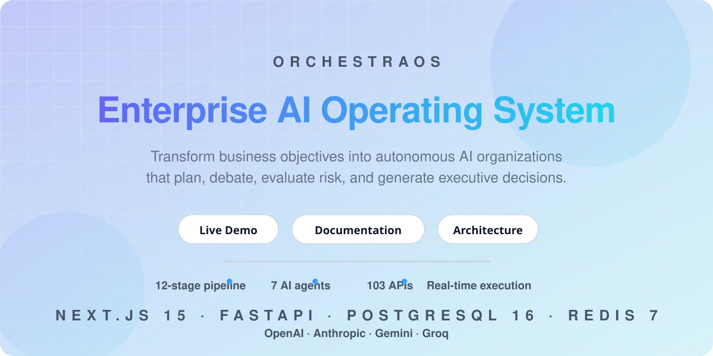
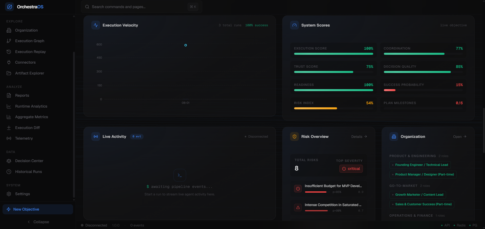
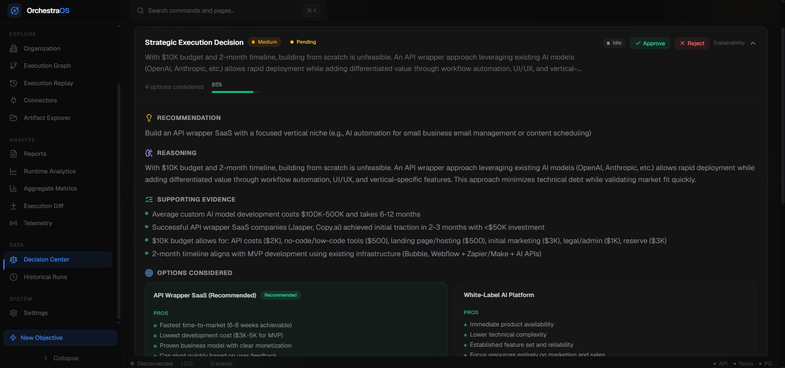
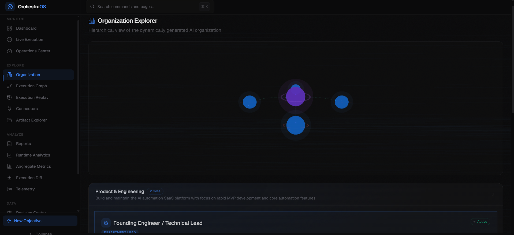
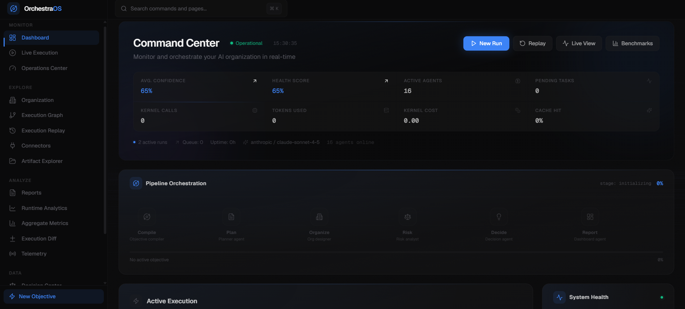
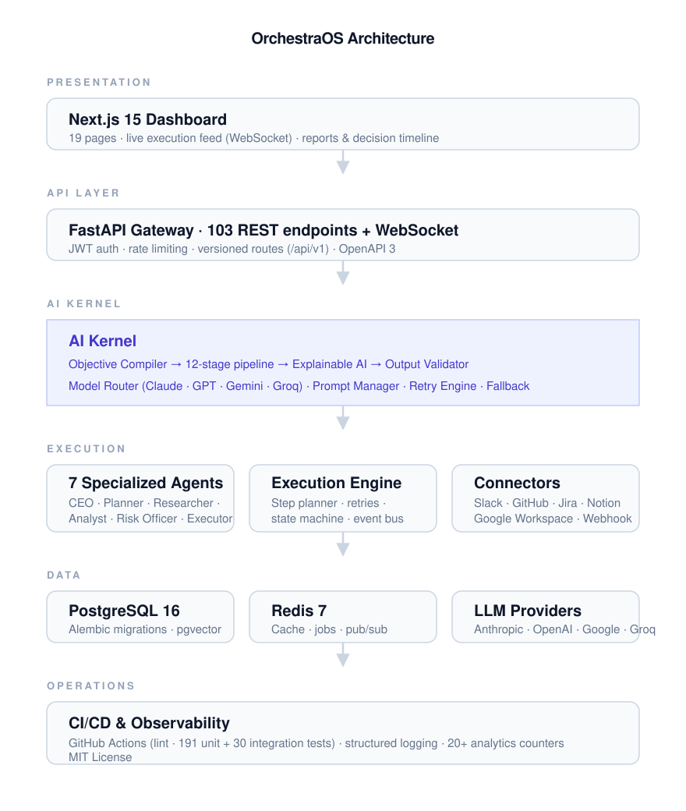

<div align="center">



# OrchestraOS

### Enterprise AI Operating System that transforms business objectives into explainable executive decisions through autonomous multi-agent orchestration.

Transform natural-language business objectives into explainable, executable strategies.
OrchestraOS compiles your goal, plans it, generates a specialized AI organization, runs a
12-stage execution pipeline with human approval gates, and produces executive-grade reports —
all with full observability, self-healing, and connector integrations.

[Live Demo](#demo) · [Documentation](docs/architecture.md) · [API Reference](docs/api.md) · [Report Samples](#screenshots)


</div>

---

## What is OrchestraOS?

OrchestraOS is a multi-agent decision intelligence platform. Give it a business objective —
*"launch a mobile banking app in 8 months"* — and it:

1. **Compiles** the objective into a structured, validated brief
2. **Plans** with milestones, dependencies, and a critical path
3. **Generates** a purpose-built AI organization (departments, roles, responsibilities)
4. **Executes** a live pipeline where specialized agents produce plans, risks, decisions, and recommendations
5. **Challenges** every output with a Devil's Advocate agent before it reaches you
6. **Reports** with executive dashboards, scenario simulations, and explainable-AI reasoning

Every step is human-verifiable: approval gates pause execution, audit logs track every action,
and a real-time Operations Center gives you full visibility.

## Why OrchestraOS?

Most AI platforms stop at *generating output*. OrchestraOS is designed for what happens after:
real organizations that need defensible decisions, not just suggestions.

| | Typical AI Copilots | OrchestraOS |
| - | ------------------- | ----------- |
| **Input** | Prompt in, answer out | Business objective → compiled brief |
| **Planning** | Ad-hoc, single-shot | 12-stage pipeline, dependency DAG, critical path |
| **Organization** | One generic agent | Purpose-built AI org (departments, roles, hierarchy) |
| **Oversight** | Human reviews a blob of text | Human approval gates inside the pipeline |
| **Reasoning** | Opaque output | Explainable AI: evidence + structured reasoning for every result |
| **Resilience** | Retry once, then fail | Self-healing: fallback models, alternate agents, repair steps |
| **History** | None | Decision Memory: every decision recorded and recallable |
| **Automation** | Static workflows | Connectors (Slack, GitHub, Jira, Notion, Google) with audit trails |

## Why we built this

Autonomous AI agents are only as useful as the confidence you can place in them. Most
pipeline tools treat agents as black boxes — you hand them a task and hope. We built
OrchestraOS around a different question: *what would an operating system look like if its
processes were AI agents and its users were executives?*

The answer is a system with an opinionated 12-stage pipeline, adversarial review, human
approval gates, and an audit trail for every decision — because a decision you can't explain
isn't a decision, it's a gamble. OrchestraOS is our attempt to make enterprise-grade AI
autonomy *accountable* by construction.

## Demo


## Screenshots

| Dashboard | Organization Explorer | Reports |
| :---: | :---: | :---: |
|  |  |  |

| Overview | | |
| :---: | :---: | :---: |
|  | | |

## Features

### 12 Competitive-Differentiation Features

| # | Feature | Description |
| - | ------- | ----------- |
| 1 | Business Readiness | Assesses market, tech, budget, team, and timeline fit |
| 2 | Missing Info Detector | Identifies gaps and generates clarification questions |
| 3 | Devil's Advocate | Adversarial critique that stress-tests every strategy |
| 4 | Success Probability | Scores success likelihood with factor breakdown |
| 5 | Resource Gap Analysis | Identifies resource deficits by category |
| 6 | Dependency Engine | Builds a dependency graph + critical path |
| 7 | Bottleneck Detection | Scans and resolves bottlenecks by severity |
| 8 | Executive Dashboard | Unified view across all features |
| 9 | Decision Memory | Records and recalls past decisions |
| 10 | Adaptive Replanning | Auto-replans on change, with memory |
| 11 | Scenario Simulator | What-if simulations with trade-off analysis |
| 12 | Explainable AI | Structured reasoning + evidence for every AI operation |

### 8 Execution Intelligence Capabilities

| # | Capability | Description |
| - | ---------- | ----------- |
| 1 | Agent Communication | Structured agent-to-agent messaging with conversations |
| 2 | Collaboration Timeline | Chronological feed of inter-agent exchanges |
| 3 | Conflict Resolution | Detect, highlight, and resolve agent disagreements |
| 4 | Human Approval Workflows | Gates that pause execution until human review |
| 5 | Long-Running Executions | Checkpoint/resume — persist state mid-pipeline |
| 6 | Execution Watchdog | Stall / infinite-retry / dependency-failure detection |
| 7 | Self-Healing Executions | Auto-retry, fallback models, alternate agents, repair |
| 8 | Operations Center | Global health score, agents, alerts, and costs |

### 6 Connectors + Webhook Engine

GitHub · Jira · Slack · Notion · Google Workspace · Webhooks
(API-key & OAuth auth, Fernet-encrypted credentials, HMAC-signed webhooks, full audit trail)

## Architecture



Highlights: a Next.js dashboard talks to a FastAPI gateway, which drives the AI Kernel's
12-stage pipeline. Seven specialized agents execute under an orchestrator with approval
gates, self-healing, and connector integrations — all persisted to PostgreSQL/Redis and
served to LLM providers through a model router with automatic fallback.

Detailed docs: [Architecture](docs/architecture.md) · [API Specification](docs/api.md) · [Product Spec](docs/SPEC.md)

## Tech Stack

| Layer | Technology |
| ----- | ---------- |
| Frontend | Next.js 15, React 19, TypeScript 5.5, Tailwind CSS, shadcn/ui |
| State & Data | TanStack Query, Zustand, React Flow |
| Backend | Python 3.12+, FastAPI, Pydantic v2, structlog |
| Database | PostgreSQL 16, pgvector, SQLAlchemy, Alembic, UUIDv7 |
| Cache / Pub-Sub | Redis 7 |
| LLM | Provider auto-detect (Anthropic, OpenAI, Gemini, Groq) + dev fallback mode |
| Real-time | WebSockets (SSE-driven live dashboard) |
| Infra | Docker, Docker Compose, GitHub Actions |
| Security | Fernet encryption, HMAC-SHA256 webhooks, RBAC (5 roles / 12 permissions) |

### Why these choices

- **FastAPI + Pydantic v2** — the API surface is 103 typed endpoints with OpenAPI docs generated
  for free; every schema is validated twice (wire → model), which matters when AI output is
  the data source.
- **Next.js 15 App Router** — a single deployment for SSR pages, API routes, and the WebSocket
  Operations Center, with React 19's server components keeping the dashboard fast.
- **PostgreSQL 16 + pgvector** — one database for relational state (plans, decisions, jobs)
  *and* the vector search behind decision memory and similarity.
- **SQLAlchemy + Alembic** — 38 models with a deterministic migration path; the CI integration
  suite runs the real migrations against PostgreSQL, not mocks.
- **Redis 7** — jobs, caches, and pub/sub for cross-service events without adding a message
  broker to the stack.
- **LLM abstraction with provider auto-detect** — the router picks Anthropic, OpenAI, Gemini,
  or Groq from available keys and falls back automatically, so the platform runs with *zero*
  API keys in development.
- **GitHub Actions** — ruff, mypy (strict), 191 unit tests, and 30 integration tests run
  against a real PostgreSQL service on every push; the badge is the contract.

## Quick Start

### Docker (recommended)

```bash
git clone https://github.com/gilldilshaan/orchestraos.git
cd orchestraos
cp .env.example .env        # add API keys (optional — fallback mode works without them)
docker compose up

# Backend:  http://localhost:8000   ·  API docs: http://localhost:8000/docs
# Frontend: http://localhost:3000
```

### Local development

```bash
# Backend
cd backend
python -m venv .venv
source .venv/bin/activate            # or .venv\Scripts\Activate.ps1 on Windows
pip install -e ".[dev]"
uvicorn app.main:app --reload --port 8000

# Frontend
cd frontend
npm install
npm run dev
```

### Demo data

```bash
cd backend && python seed_demo_data.py   # clean demo objectives in-place
```

## Project Structure

```
orchestraos/
├── backend/
│   ├── app/
│   │   ├── agents/            # 7 agents (Planner, Risk, Org, Decision, DA, CEO, ...)
│   │   ├── api/v1/            # 103 route handlers
│   │   ├── connectors/        # 6 connectors + webhook engine
│   │   ├── database/          # SQLAlchemy, Alembic, UUIDv7
│   │   ├── kernel/            # AI Kernel (23 modules)
│   │   ├── llm/               # LLM abstraction with provider auto-detect
│   │   ├── models/            # 38 SQLAlchemy models
│   │   ├── repositories/      # Data access layer (9 repos)
│   │   ├── schemas/           # Pydantic v2 schemas
│   │   ├── services/          # Business logic (18 services)
│   │   └── main.py            # App entrypoint
│   ├── migrations/            # Alembic migrations
│   ├── prompts/               # 14 versioned prompt templates
│   ├── tests/                 # 191 unit + 30 integration tests
│   └── Dockerfile
├── frontend/
│   ├── app/                   # 19 pages (Next.js App Router)
│   ├── components/            # React components
│   ├── hooks/ · lib/ · providers/ · services/ · store/ · types/
│   └── Dockerfile
├── docs/                      # architecture.md, api.md, SPEC.md
├── scripts/                   # dev helpers
├── docker-compose.yml
├── .env.example
└── README.md
```

## API Overview

**103 endpoints** across system, objectives, plans, organizations, risks, decisions,
features, execution intelligence, connectors, and real-time WebSockets.

| Area | Highlights |
| ---- | ---------- |
| Objectives | `POST /objectives` → compile → full-pipeline (async) |
| Plans | approve · adaptive replan · version history |
| Organizations | AI-generated org structure |
| Features | readiness · devils-advocate · success-probability · scenarios · explainable-ai · more |
| Intelligence | agent messages · conflicts · approval gates · checkpoints · alerts · self-healing |
| Connectors | CRUD · execute · audit · webhooks · marketplace |
| Real-time | `ws://host/ws/{objective_id}` live dashboard stream |

→ **Full reference:** [docs/api.md](docs/api.md)

## Repository Metrics

| | |
| - | - |
| REST + WebSocket endpoints | 103 |
| Tests | 191 unit + 30 integration |
| AI agents | 7 |
| AI Kernel modules | 23 |
| SQLAlchemy models | 38 |
| Backend services | 18 |
| Frontend pages | 19 |
| Prompt templates (versioned) | 14 |
| Connectors | 6 + Webhook Engine |

## Testing & Quality

```bash
cd backend
pytest -m "not integration"    # 191 unit tests (no database required)
pytest -m integration          # 30 integration tests (requires PostgreSQL)
ruff check app/                # linting
mypy app/                      # type checking
```

GitHub Actions runs ruff, mypy, pytest, and the frontend build on every push to `main`.

## Roadmap

### v1.1 — Memory & Delegation
- [ ] Persistent agent memory across objectives (episodic + semantic retrieval)
- [ ] Multi-LLM conversation routing with cost optimization dashboards
- [ ] Model-agnostic output benchmarking (`backend/benchmarks/`)

### v1.2 — Enterprise Autonomy
- [ ] Slack + Jira two-way execution commands (approve, replan, report via chat)
- [ ] GitHub Actions-style scheduled runs and recurring objective reviews
- [ ] Fine-tuned domain-specific specialist agents

### v2.0 — Autonomous Operations
- [ ] Self-executing connectors: agents act on Slack/GitHub/Jira without human steps
- [ ] Multi-objective portfolio orchestration with shared resource pools
- [ ] SaaS multi-tenant mode with org-level RBAC and quotas

## Contributing

Pull requests are welcome. For major changes, please open an issue first to discuss what
you'd like to change. Follow [Conventional Commits](https://www.conventionalcommits.org)
(`feat:`, `fix:`, `docs:`, ...).

## License

[MIT](LICENSE)
