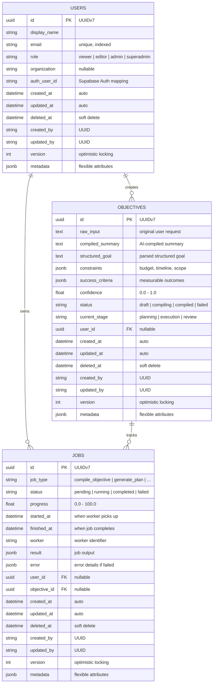

# Database Layer

## ER Diagram



## Relationships

| From       | To         | Type        | Description                  |
| ---------- | ---------- | ----------- | ---------------------------- |
| User       | Objective  | One to Many | A user can create objectives |
| User       | Job        | One to Many | A user owns jobs             |
| Objective  | Job        | One to Many | An objective can have jobs   |

## Indexes

### Users
| Index Name            | Column(s)   | Type      | Purpose                     |
| --------------------- | ----------- | --------- | --------------------------- |
| `ix_users_email`      | email       | UNIQUE    | Fast lookup by email        |
| `ix_users_role`       | role        | B-tree    | Filter by role              |
| `ix_users_created_at` | created_at  | B-tree    | Sort by creation time       |
| `ix_users_deleted_at` | deleted_at  | B-tree    | Soft-delete filtering       |

### Objectives
| Index Name                  | Column(s)   | Type   | Purpose                     |
| --------------------------- | ----------- | ------ | --------------------------- |
| `ix_objectives_status`      | status      | B-tree | Filter by status            |
| `ix_objectives_user_id`     | user_id     | B-tree | Filter by user              |
| `ix_objectives_created_at`  | created_at  | B-tree | Sort by creation time       |
| `ix_objectives_updated_at`  | updated_at  | B-tree | Sort by update time         |
| `ix_objectives_deleted_at`  | deleted_at  | B-tree | Soft-delete filtering       |

### Jobs
| Index Name              | Column(s)     | Type   | Purpose                     |
| ----------------------- | ------------- | ------ | --------------------------- |
| `ix_jobs_status`        | status        | B-tree | Filter by status            |
| `ix_jobs_job_type`      | job_type      | B-tree | Filter by job type          |
| `ix_jobs_user_id`       | user_id       | B-tree | Filter by user              |
| `ix_jobs_objective_id`  | objective_id  | B-tree | Filter by objective         |
| `ix_jobs_created_at`    | created_at    | B-tree | Sort / pagination           |
| `ix_jobs_updated_at`    | updated_at    | B-tree | Sort / stale detection      |
| `ix_jobs_deleted_at`    | deleted_at    | B-tree | Soft-delete filtering       |

## Migration Strategy

### Naming Convention

```
YYYYMMDD_description
```

Example: `20260728_initial_schema`

### Creating New Migrations

```bash
cd backend
alembic revision -m "add_plans_table" --rev-id 20260729
```

### Running Migrations

```bash
# Upgrade to latest
alembic upgrade head

# Rollback one step
alembic downgrade -1

# Rollback to specific
alembic downgrade 20260728_initial_schema

# View history
alembic history

# Show pending
alembic current
```

### Migration File Template

Migrations are located in `backend/migrations/versions/`. Each file contains:

- `revision`: Unique identifier matching `YYYYMMDD_description`
- `down_revision`: Previous migration revision (None for initial)
- `upgrade()`: Forward migration logic
- `downgrade()`: Rollback logic

### Best Practices

1. **One concern per migration**: Each migration should add/remove a single concept
2. **Always implement downgrade**: Every upgrade must have a reversible downgrade
3. **Test both directions**: Run `alembic upgrade head && alembic downgrade -1` before committing
4. **Avoid data migrations in schema changes**: Separate schema from data migrations
5. **Use transactions**: Wrap destructive operations in transactions

## Extensions Enabled

| Extension   | Purpose                                  |
| ----------- | ---------------------------------------- |
| pgvector    | Vector similarity search for memory      |
| uuid-ossp   | UUID generation utilities                |
| pgcrypto    | Cryptographic functions (future use)     |

## UUIDv7

All tables use UUIDv7 as primary keys. UUIDv7 provides:

- **Time-ordered**: Monotonically increasing, enables B-tree clustering
- **Globally unique**: No collision risk across distributed systems
- **Client-generated**: No round-trip to database for ID generation
- **URL-safe**: Shorter than integer IDs in URLs, no sequential enumeration

Format: `tttttttt-tttt-7xxx-[89ab]xxx-xxxxxxxxxxxx`

- `t`: 48-bit Unix timestamp (milliseconds)
- `7`: Version indicator
- `[89ab]`: RFC 4122 variant
- `x`: Random bits

## Soft Delete Pattern

All entities support soft delete via `deleted_at` column:

- `deleted_at IS NULL`: Active records
- `deleted_at IS NOT NULL`: Deleted records
- All repository queries filter `deleted_at IS NULL` by default
- Hard deletes are never performed; data is preserved for audit

## Audit Fields

Every entity tracks:

| Field        | Purpose                          |
| ------------ | -------------------------------- |
| `created_at` | When record was created          |
| `updated_at` | When record was last modified    |
| `deleted_at` | When record was soft-deleted     |
| `created_by` | Who created the record (UUID)    |
| `updated_by` | Who last modified the record     |
| `version`    | Optimistic locking counter       |

`created_at` and `updated_at` are managed automatically by the ORM.

`version` increments on every update via the repository layer.

## JSONB Usage

JSONB columns provide schema flexibility:

| Table      | JSONB Column   | Purpose                         |
| ---------- | -------------- | ------------------------------- |
| All tables | `metadata`     | Flexible attributes per entity  |
| Objectives | `constraints`  | Budget, timeline, scope limits  |
| Objectives | `success_criteria` | Measurable outcomes         |
| Jobs       | `result`       | Job completion output           |
| Jobs       | `error`        | Job failure details             |

## Repository Layer

The repository pattern provides:

- **BaseRepository**: Generic CRUD with soft delete filtering
- **Type-safe**: Generic type parameter ensures repository methods return the correct model type
- **Transaction-safe**: All operations use the injected session; commit/rollback handled by caller

### Repository Methods (BaseRepository)

| Method          | Description                              |
| --------------- | ---------------------------------------- |
| `create(entity)` | Insert a new entity                      |
| `get(id)`       | Fetch by ID (excludes soft-deleted)      |
| `get_by_ids(ids)` | Bulk fetch by IDs                      |
| `list()`        | Paginated listing with optional ordering |
| `update(id, values)` | Partial update with version increment|
| `soft_delete(id)` | Mark as deleted                        |
| `count()`       | Count active records                     |
| `exists(id)`    | Check if record exists                   |

## pgvector

The pgvector extension is enabled in the database and ready for use. The `VECTOR` type is available for future memory/embedding columns.

### Vector Index

When the `Memories` table is added, a vector index will be created:

```sql
CREATE INDEX ix_memories_embedding ON memories
USING ivfflat (embedding vector_cosine_ops)
WITH (lists = 100);
```

### Cosine Similarity Search (prepared)

```python
from pgvector.sqlalchemy import Vector
from sqlalchemy import select

query = """
SELECT * FROM memories
ORDER BY embedding <=> :target
LIMIT :limit
"""
```

## Testing

### Test Structure

```
tests/
├── conftest.py              # Fixtures (session, engine)
├── test_models.py           # Model unit tests
├── test_repositories.py     # Repository integration tests
└── test_migrations.py       # Migration integration tests
```

### Running Tests

```bash
# Unit tests only (no database needed)
cd backend
pytest tests/test_models.py -v

# All tests (requires PostgreSQL)
pytest -v

# Integration tests only
pytest -m integration -v

# With coverage
pytest --cov=app --cov-report=term-missing
```

### Test Markers

| Marker         | Description                          |
| -------------- | ------------------------------------ |
| `integration`  | Requires a running PostgreSQL server |

### CI Integration

Tests run in CI via GitHub Actions (`backend-test` job in `.github/workflows/ci.yml`).
